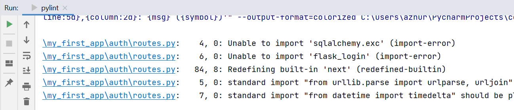
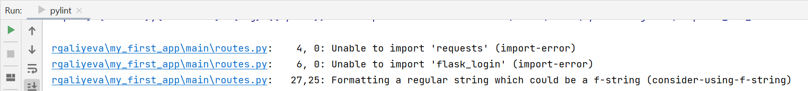
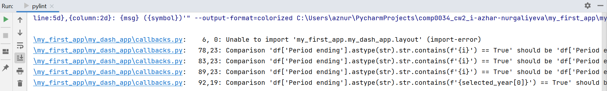
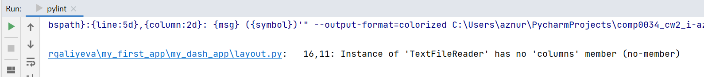
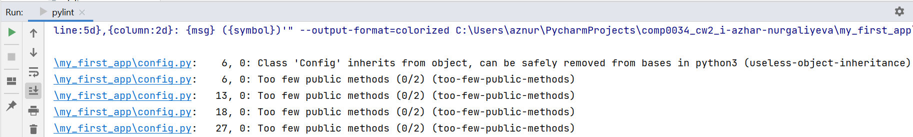
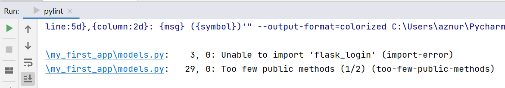

# Coursework 2 for COMP0034

[Repository link](https://github.com/ucl-comp0035/comp0034_cw2_i-azhar-nurgaliyeva)

**requirements.txt** - contains all the package dependencies for the project.

**.gitignore file** - informs Git which files should be ignored when committing the project to the repository on GitHub.

**app.py** - run to see the output at http://127.0.0.1:5000/.

**setup.py** - description of the project and all the files that belong to it.

**MANIFEST.in** - needed to include other files such as static and templates directories.

Data used for the Dash app is provided by Transport for London (TfL) and can be accessed from here: [1].

## Flask app

This Flask app demonstrates the following features:

- Responsive design, which is achieved using Bootstrap library.
- Dash app is launched as one of the routes in the web app.
- There is signup/login/logout and restriction of access to the Dash App to not logged-in users.
- The data entered by users (login details, feedback messages) are captured and stored in the database.
- Stored users' data is used for login purposes in a SQLite database, and can be accessed there.

Additional features of the Flask app include:

- Transport related stories using a third party API (Google News API) to provide content on the home page.
- Contact us form in the "more" dropdown of the navigation bar. This form allows all users to leave feedback or contact
  us. The message and details are stored in the "messages" table of the database. [2][3]
- Sending email to the user after they use "Contact us" form with the copy of their message. [4][5]

## Pylint reports

**my_first_app.app.py**:

Your code has been rated at 10.00/10 (previous run: 10.00/10, +0.00)

**my_first_app.auth.forms**:

Your code has been rated at 4.24/10 (previous run: 2.73/10, +1.52)

**my_first_app.auth.routes**:

Your code has been rated at 8.22/10 (previous run: 7.12/10, +1.10)

**my_first_app.main.routes**:

Your code has been rated at 5.00/10 (previous run: 3.18/10, +1.82)

**my_first_app.my_dash_app.callbacks**:

Your code has been rated at 8.00/10 (previous run: 7.17/10, +0.83)

**my_first_app.my_dash_app.layout**:

Your code has been rated at 8.28/10 (previous run: 7.93/10, +0.34)

**my_first_app.config**:

Your code has been rated at 7.06/10 (previous run: 4.71/10, +2.35)

**my_first_app.models**:

Your code has been rated at 7.50/10 (previous run: 6.67/10, +0.83)

Most of the unresolved errors related to code quality are connected to the import error. I tried to find a solution for 
it, but did not find anything reliable. It is documented in GitHub issues as unresolved.

## References

[1] Transport for London (TfL), “Public Transport Journeys by Type of Transport – London Datastore.” Available
at: https://data.london.gov.uk/dataset/public-transport-journeys-type-transport

[2] “Create Contact Us using WTForms in Flask,” GeeksforGeeks, Jul. 17, 2021.
https://www.geeksforgeeks.org/create-contact-us-using-wtforms-in-flask/ (accessed Apr. 07, 2022).

[3] “How To Use Web Forms in a Flask Application | DigitalOcean,” www.digitalocean.com.
https://www.digitalocean.com/community/tutorials/how-to-use-web-forms-in-a-flask-application

[4] “Sending Emails with Flask - Step-by-Step Flask-Mail Guide | Mailtrap Blog,” mailtrap.io.
https://mailtrap.io/blog/flask-email-sending/

[5] “Send an E-mail with Python Flask - Python Tutorial,” pythonbasics.org.
https://pythonbasics.org/flask-mail/#:~:text=Flask%20doesn (accessed Apr. 07, 2022).