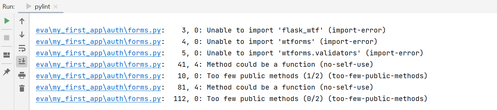

# Coursework 2 for COMP0034

[Repository link](https://github.com/ucl-comp0035/comp0034_cw2_i-azhar-nurgaliyeva)

**requirements.txt** - contains all the package dependencies for the project.

**.gitignore file** - informs Git which files should be ignored when committing the project to the repository on GitHub.

**setup.py** - description of the project and all the files that belong to it.

**MANIFEST.in** - needed to include other files such as static and templates directories.

## Flask app example with a basic structure

A minimal app to demonstrate how to structure and configure a Flask app.

## Explanation

## Pylint reports

**my_first_app.app.py**:

Your code has been rated at 10.00/10 (previous run: 10.00/10, +0.00)

**my_first_app.auth.forms**: 

Your code has been rated at 4.24/10 (previous run: 2.73/10, +1.52)

**my_first_app.auth.routes**:

Your code has been rated at 8.22/10 (previous run: 7.12/10, +1.10)

**my_first_app.main.routes**:

Your code has been rated at 5.00/10 (previous run: 3.18/10, +1.82)

**my_first_app.my_dash_app.callbacks**:

Your code has been rated at 8.00/10 (previous run: 7.17/10, +0.83)

**my_first_app.my_dash_app.layout**:

Your code has been rated at 8.28/10 (previous run: 7.93/10, +0.34)

**my_first_app.config**:

Your code has been rated at 7.06/10 (previous run: 4.71/10, +2.35)

**my_first_app.models**:

Your code has been rated at 7.50/10 (previous run: 6.67/10, +0.83)

## References

[1] ...
